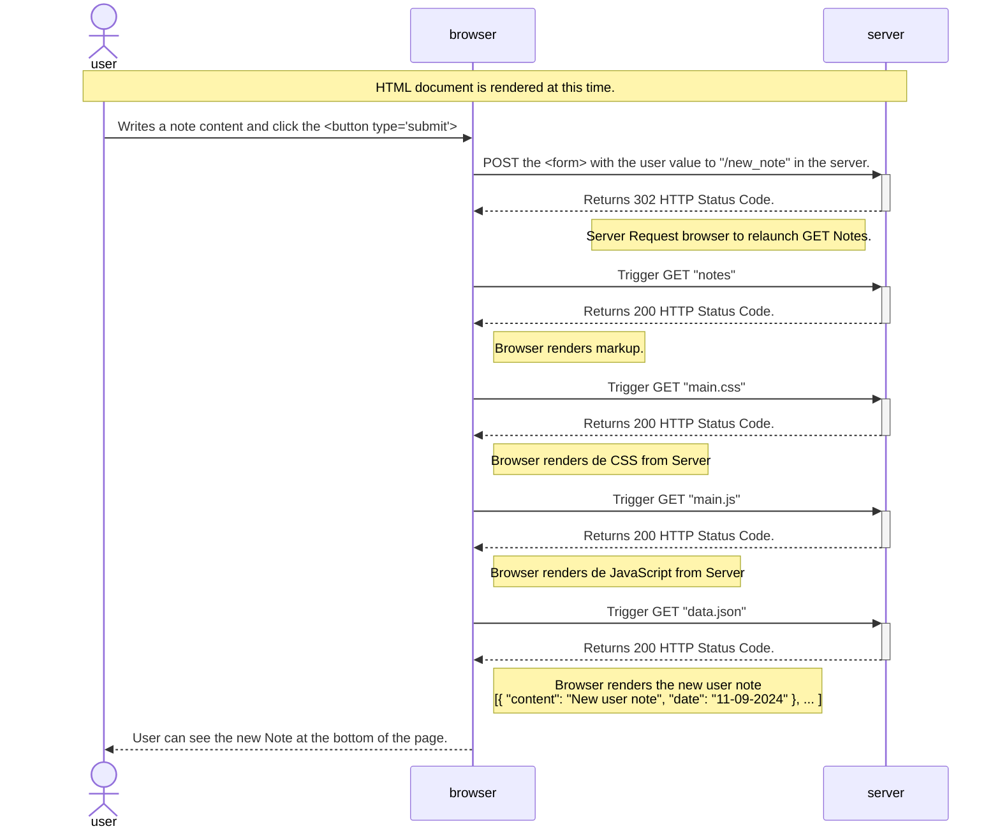

```mermaid
sequenceDiagram
actor user
participant browser
participant server

Note over user,server : HTML document is rendered at this time.

user->>browser: Writes a note content and click the <button type="submit">

browser->>+server: POST the <form> with the user value to "/new_note" in the server.
server-->>browser: Returns 302 HTTP Status Code.
deactivate server
Note left of server: Server Request browser to relaunch GET Notes.

browser->>+server: Trigger GET "notes"
server-->>browser: Returns 200 HTTP Status Code.
deactivate server
Note right of browser: Browser renders markup.

browser->>+server: Trigger GET "main.css"
server-->>browser: Returns 200 HTTP Status Code.
deactivate server
Note right of browser: Browser renders de CSS from Server

browser->>+server: Trigger GET "main.js"
server-->>browser: Returns 200 HTTP Status Code.
deactivate server
Note right of browser: Browser renders de JavaScript from Server

browser->>+server: Trigger GET "data.json"
server-->>browser: Returns 200 HTTP Status Code.
deactivate server
Note right of browser: Browser renders the new user note<br/>[{ "content": "New user note", "date": "11-09-2024" }, ... ]

browser-->>user: User can see the new Note at the bottom of the page.
```