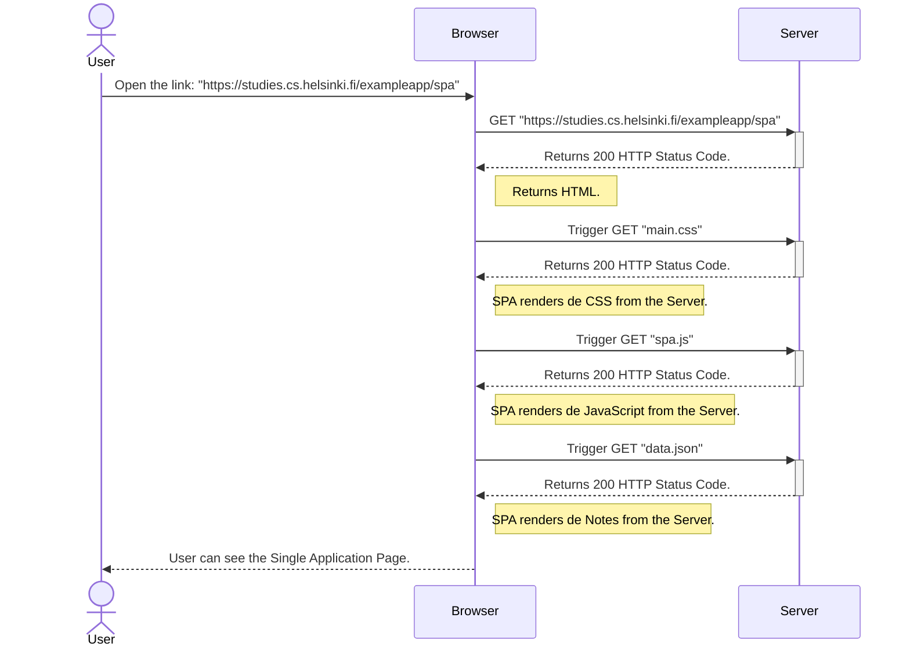

```mermaid
sequenceDiagram
actor user as User
participant SPA as Browser
participant server as Server

user->>SPA: Open the link: "https://studies.cs.helsinki.fi/exampleapp/spa"
SPA->>+server: GET "https://studies.cs.helsinki.fi/exampleapp/spa"
server-->>SPA: Returns 200 HTTP Status Code.
deactivate server
Note right of SPA: Returns HTML.

SPA->>+server: Trigger GET "main.css"
server-->>SPA: Returns 200 HTTP Status Code.
deactivate server
Note right of SPA: SPA renders de CSS from the Server.

SPA->>+server: Trigger GET "spa.js"
server-->>SPA: Returns 200 HTTP Status Code.
deactivate server
Note right of SPA: SPA renders de JavaScript from the Server.

SPA->>+server: Trigger GET "data.json"
server-->>SPA: Returns 200 HTTP Status Code.
deactivate server
Note right of SPA: SPA renders de Notes from the Server.

SPA-->>user: User can see the Single Application Page.
```