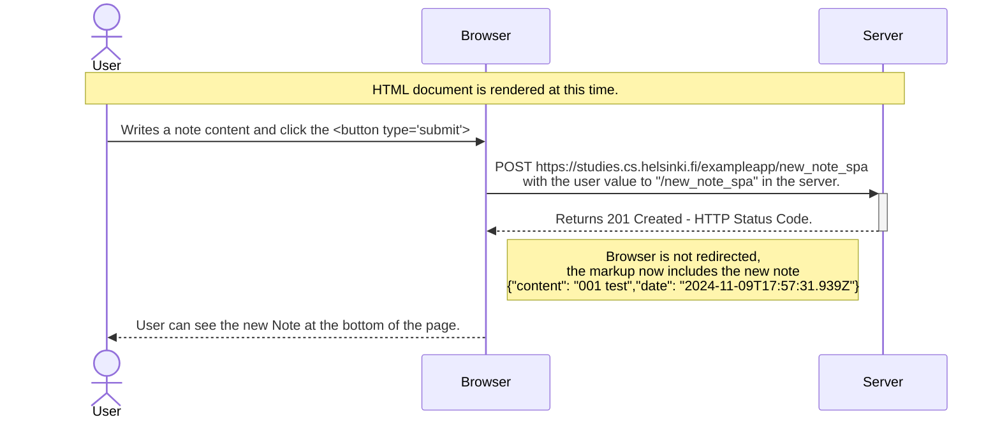

```mermaid
sequenceDiagram

actor user as User
participant SPA as Browser
participant server as Server

Note over user,server : HTML document is rendered at this time.

user->>SPA: Writes a note content and click the <button type="submit">

SPA->>+server: POST https://studies.cs.helsinki.fi/exampleapp/new_note_spa <br/>with the user value to "/new_note_spa" in the server.
server-->>SPA: Returns 201 Created - HTTP Status Code.
deactivate server
Note right of SPA: Browser is not redirected,<br/> the markup now includes the new note<br/>{"content": "001 test","date": "2024-11-09T17:57:31.939Z"}

SPA-->>user: User can see the new Note at the bottom of the page.
```